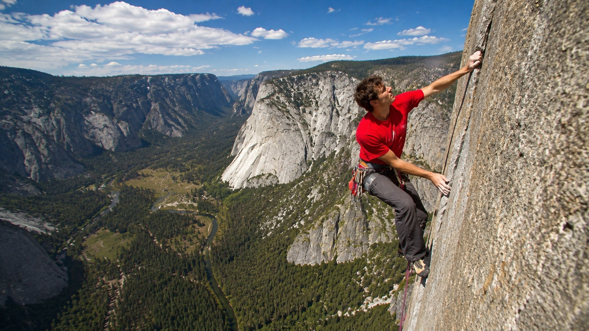

```{r}
#| label: libraries
#| include: false

library(tidyverse)
library(kableExtra)
library(DT)
library(corrplot)
library(plotly)
library(viridis)
library(ggthemes)
library(plotly)
library(ggplot2)
library(viridis)
library(patchwork)

climber_df <- read.csv("data/climber_df.csv")

# Czyszczenie
climber_df_clean_temp <- climber_df %>%
  select(user_id, country, sex, height, weight, age, years_cl, grades_max, year_first, year_last) %>%
  filter(
    height > 120 & height < 220,
    weight > 35 & weight < 130,
    years_cl >= 0,
    grades_max > 0,
    age >= 10 & age < 70,
    (age - years_cl) >= 4,
    year_first > 1990,
    year_last < 2026,
    year_first <= year_last,
    country != "other",
    !(years_cl <= 2 & grades_max > 49),
    !(years_cl <= 4 & grades_max > 60)
  ) %>%
  
# Tworzenie nowych zmiennych
  mutate(
    BMI = round(weight / ((height/100)^2), 2),
    sex = factor(ifelse(sex == 0, "Mężczyzna", "Kobieta")),
    is_pro = case_when(
      sex == "Mężczyzna" & grades_max >= 66 ~ "Profesjonalista",
      sex == "Kobieta" & grades_max >= 62 ~ "Profesjonalista",
      sex == "Mężczyzna" & grades_max < 66 ~ "Amator",
      sex == "Kobieta" & grades_max < 62 ~ "Amator"
    )
  )

climber_df_clean  <- climber_df_clean_temp %>%
  filter(
    !(grades_max >= 62 & BMI >= 28)
  )
```

{fig-align="center"}

# Wstęp

Wspinaczka sportowa to dyscyplina, w której grawitacja jest ostatecznym sędzią. Jest to sport unikalny, gdzie stosunek mocy do masy ciała odgrywa rolę krytyczną. Wybór tematu nie jest przypadkowy. Wspinaczkę trenuję aktywnie od dwóch lat, śledząc jednocześnie profesjonalną scenę zawodniczą. Postanowiłem sprawdzić, czy moje obserwacje z treningów znajdują odzwierciedlenie w tej analizie.

Projekt ma na celu weryfikację postawionych przeze mnie tez i hipotez przy użyciu twardych danych. Sprawdzimy między innymi, czy sukces zależy bardziej od budowy ciała (biologia), czy od doświadczenia (trening).

# Tezy i Hipotezy Badawcze

::: callout-important
### Pytania Badawcze

1.  **Korelacja cech:** Jak wzrost i waga wspinacza korelują z jego maksymalnym osiągniętym poziomem wspinaczkowym?
2.  **Profil Elity:** Czy profil antropometryczny (wzrost, waga, BMI) wspinaczy z elity różni się znacząco od profilu wspinaczy na niższych poziomach zaawansowania?
3.  **Geografia:** W których krajach występuje największa koncentracja wspinaczy o najwyższym poziomie zaawansowania w stosunku do ogólnej liczby wspinaczy z danego kraju?
4.  **Różnice płci:** Jak prezentują się różnice w budowie fizycznej (waga, wzrost, BMI) w grupie profesjonalnej i jak te parametry zestawiają się ze średnim maksymalnym wynikiem osiąganym przez każdą z płci?
:::

# Eksploracja Zbioru Danych

W analizie wykorzystano zbiór danych \`Climb Dataset\` opublikowany w serwisie Kaggle \[\@jordizar_climb_dataset\].

::: callout-note
**1. Wyjasnienie skali trudności (level)** <br> Dane wykorzystują system konwersji punktowej który również jest załączony w formie oddzielnego pliku - grades_conversion_table.csv, który mapuje trudność drogi (skala francuska) na wartości liczbowe (Level) w celu umożliwienia analizy.<br> Przykłady: <br> - **49 = 7a** <br> - **50 = 7a/7a+** <br> - **51 = 7a+** <br> - **52 = 7a+/7b** <br> - **53 = 7b**

**2. W naszej analizie status Profesjonalisty jest przydzielany**<br> \* **Mężczyznom**, którzy osiągnęli co najmniej **66. poziom** (trudność 8b/+).<br> \* **Kobietom**, które osiągnęły co najmniej **62. poziom** (trudność 8a/+).

**3. Ważne zastrzeżenie**<br> Zbiór danych pochodzi z portalu 8a.nu. Na tej stronie w większości rejestrują się aktywni, trenujący wspinacze (nie niedzielni wspinacze). Dlatego odsetek ludzi na wysokim poziomie (PRO) jest tutaj wyższy niż w ogólnej populacji. Wszystkie wnioski odnoszą się do społeczności wspinaczkowej, a nie ogólnej ludzkości. Aczkolwiek nie podważa to wniosków dotyczących trendów i korelacji (np. wpływ wagi na wynik). Fundametnalne prawa fizyki rządzące wspinaczką pozostają uniwersalne i prawidze.
:::

```{r}
#| label: table
#| echo: false

climber_df_table <- climber_df_clean %>% 
  sample_n(1000) %>% 
  select(Kraj = country, Płeć = sex, Wzrost = height, 
         Waga = weight, BMI, Staż = years_cl, Level = grades_max, Status = is_pro)

datatable(climber_df_table, 
          filter = 'top',
          options = list(
            pageLength = 10,
            autoWidth = TRUE
          ),
          caption = "Tabela 1. Przegląd losowej próbki danych (1000 wierszy)"
)
```

# Analiza

## Jak wzrost i waga wspinacza korelują z jego maksymalnym osiągniętym poziomem wspinaczkowym?

```{r}
#| label: Pierwsze pytanie
#| echo: false
#| message: false

df_weight <- climber_df_clean %>%
  filter(age>17)%>%
  mutate(weight_rounded = round(weight / 2.5) * 2.5) %>% 
  group_by(weight_rounded, sex) %>%
  summarise(
    Mean_Level = mean(grades_max),
    .groups = "drop"
  )


df_height <- climber_df_clean %>%
  filter(age>17)%>%
  mutate(height_rounded = round(height / 3) * 3) %>%
  group_by(height_rounded, sex) %>%
  summarise(
    Mean_Level = mean(grades_max),
    .groups = "drop"
  )


p_weight <- ggplot(df_weight, aes(x = weight_rounded, y = Mean_Level, color = sex)) +
  geom_smooth(aes(group = 1), method = "lm", se = FALSE, color = "black", linetype = "dashed", linewidth = 1) +
  geom_line(linewidth = 1.2) + 
  geom_point(size = 2, alpha = 0.5) +
  scale_color_manual(values = c("Kobieta" = "pink", "Mężczyzna" = "lightblue")) +
  theme_minimal() +
  labs(title = "A. Średnia forma wg Wagi (kg)",
       x = "Waga (kg)", y = "Średni Wynik (Level)") +
  theme(legend.position = "right")


p_height <- ggplot(df_height, aes(x = height_rounded, y = Mean_Level, color = sex)) +
  geom_smooth(aes(group = 1), method = "lm", se = FALSE, color = "black", linetype = "dashed", linewidth = 1) +
  geom_line(linewidth = 1.2) +
  geom_point(size = 2, alpha = 0.5) +
  scale_color_manual(values = c("Kobieta" = "pink", "Mężczyzna" = "lightblue")) +
  theme_minimal() +
  labs(title = "B. Średnia forma wg Wzrostu (cm)",
       x = "Wzrost (cm)", y = "Średni Wynik (Level)") +
  theme(legend.position = "right")

p_weight/p_height

```

::: note
### Interpretacja Wykresów

Powyższe wykresy prezentują uśrednione wyniki w grupie ***profesjonalistów***. Każdy punkt na linii oznacza średni poziom trudności osiągany przez wspinaczy o tej konkretnej wadze lub wzroście.

1.  **Waga:** Czarna linia trendu opada jednostajnie w dół wraz ze wzrostem masy ciała. Widać wyraźnie, że najwyższe średnie wyniki osiągają najlżejsi zawodnicy. Każdy dodatkowy kilogram statystycznie utrudnia wspinaczkę.
2.  **Wzrost:** Czarna linia jest niemal pozioma, rzeczywiste dane (kolorowe linie) są bardzo niestabilne i mocno oscylują. Oznacza to, że wzrost nie jest decydującym czynnikiem – w grupie profesjonalistów wybitne wyniki osiągają zarówno osoby niskie, jak i wysokie. Co by się zgadzało z profesjonalną sceną wspinaczkową.
:::

## Czy profil antropometryczny (wzrost, waga, BMI) wspinaczy z elity różni się znacząco od profilu wspinaczy na niższych poziomach zaawansowania?

```{r}
#| label: Drugie pytanie
#| echo: false
#| message: false


# WYKRES A: Gęstość WAGI
d_weight <- ggplot(climber_df_clean, aes(x = weight, fill = is_pro)) +
  geom_density(alpha = 0.5, adjust = 2) +
  facet_wrap(~sex) +
  theme_minimal() +
  labs(title = "B. Profil Wagi (Amator vs Pro)",
       x = "Waga (kg)", y = "Gęstość")+
  theme(legend.position = "none")

# WYKRES B: Gęstość WZROSTU
d_height <- ggplot(climber_df_clean, aes(x = height, fill = is_pro)) +
  geom_density(alpha = 0.5, adjust = 2) +
  facet_wrap(~sex) +
  theme_minimal() +
  labs(title = "C. Profil Wzrostu (Amator vs Pro)",
       x = "Wzrost (cm)", y = "Gęstość")+
  theme(legend.position = "none")

# WYKRES C: Gęstość BMI
d_bmi <- ggplot(climber_df_clean, aes(x = BMI, fill = is_pro)) +
  geom_density(alpha = 0.5, adjust = 2) + 
  facet_wrap(~sex) + 
  theme_minimal() +
  labs(title = "A. Profil BMI (Amator vs Pro)",
       x = "BMI", y = "Gęstość",
       fill = "Status zawodnika - ")+
  theme(legend.position = "top")

d_weight
d_height
d_bmi
```

::: note
### Interpretacja Wykresów

Powyższe wykresy pokazują rozkład gęstości cech antropometrycznych, które porównują amatorów i profesjonalistów.

1.  **Waga:** Podobnie jak w BMI, krzywa jest przesunięta w lewą stronę oraz szczyt gęstości znajduje się przy mniejszych wartościach. Potwierdza to, że niższa masa ciała jest cechą dla profesjonalistów.
2.  **Wzrost:** Co ciekawe jeśli chodzi o wzrost, krzywe niemal pokrywają się w całości. Oznacza to że wzrost obu grup jest statystycznie taki sam. Nie ma idealnego wzrostu, który odróżniałby mistrzów od reszty.
3.  **BMI:** Szczyt wykresu dla profesjonalistów jest przesunięta w lewą stronę względem amatorów. Dodatkowo gęstość wykresu również jest wyższa i węższa dla profesjonlistów. Oznacza to, że najlepsi wspinacze to bardzo skondensowana grupa, niemal wszyscy mieszczą się w wąskim przedziale optymalnego BMI. Z kolei amatorzy mają bardziej zróżnicowane sylwetki.
:::

## W których krajach występuje największa koncentracja wspinaczy o najwyższym poziomie zaawansowania w stosunku do ogólnej liczby wspinaczy z danego kraju?

```{r}
#| label: Trzecie pytanie
#| echo: false
#| message: false


country_stats <- climber_df_clean %>%

  group_by(country) %>%
  summarise(
    Total_Climbers = n(),
    Pro_Count = sum(is_pro == "Profesjonalista"),
    Pro_Ratio = Pro_Count / Total_Climbers
  ) %>%
  filter(Total_Climbers >= 50) %>%
  arrange(desc(Pro_Ratio)) %>%
  slice_head(n = 15)


p_geo <- ggplot(country_stats, aes(x = reorder(country, Pro_Ratio), y = Pro_Ratio)) +
  geom_col(fill = "steelblue") +
  coord_flip() +
  theme_minimal() +
  scale_y_continuous(labels = scales::percent_format()) +
  labs(title = "Ranking Krajów: Gdzie jest najwięcej 'PRO'?",
       subtitle = "Odsetek profesjonalistów wśród wspinaczy z danego kraju",
       x = "Kraj", y = "Odsetek Profesjonalistów")

p_geo

```

::: note
### Interpretacja Wykresów

Powyższy wykres pokazuje fascynujące trendy w geograficznym rozmieszczeniu talentów wspinaczkowych. Choć prezentowane wartości procentowe są zawyżone ze względu na specyfikę użytkowników portalu 8a.nu, to sama kolejność krajów w rankingu precyzyjnie oddaje realny układ sił w światowej wspinaczce\*\*.

1.  **Dominacja Europy:** Aż 12 z 15 czołowych krajów to państwa europejskie. Wynika to nie tylko z uwarunkowań geograficznych – takich jak łatwy dostęp do Alp czy innych licznych rejonów skalnych – ale również z głęboko zakorzenionej tradycji. Dzieki tak dużym zagęszczeniu rejonów skalnych, europejczycy mają łatwiejszy dostęp do treningów w naturalnym środowisku, co jest kluczowe do rozwoju umiejętności na wysokim poziomie. Nasz kontynet jest uważany za centrum światowej wspinaczki.

2.  **Fenomen Słowenii i Czechy:** Te kraje deklasują resztę świata. Jest to efekt wyjątkowego podejścia kulturowego, w którym wspinaczka jest sportem priorytetowym. **Słowenia** mimo małej populcji (2,1 miliona) "produkuje" nieproporcjonalnie dużą ilość zawodników klasy światowej. Przykładem takim jest Janja Garnbret, która zdobyła 10 tytułów mistrzyni świata, co jest również zasługą niesamowitego sytemu szkolenia młodzieży. **Czechy** z kolei posiadają swojego lokalnego celebrytę Adama Ondre, który jako pierwszy oraz jedyny człowiek na świecie ukończył trasę wspinaczkową "Silence" o mitycznym poziomie trudności 9c.
:::

## Jak prezentują się różnice w budowie fizycznej (waga, wzrost, BMI) w grupie profesjonalnej i jak te parametry zestawiają się ze średnim maksymalnym wynikiem osiąganym przez każdą z płci?

```{r}
#| label: Czwarte pytanie
#| echo: false
#| message: false

df_gender <- climber_df_clean %>%
  filter(is_pro == "Profesjonalista", age > 17)


means <- df_gender %>%
  group_by(sex) %>%
  summarise(
    m_weight = round(mean(weight),1),
    m_height = round(mean(height),1),
    m_BMI = round(mean(BMI),1),
    m_grades_max = round(mean(grades_max),1)
  )
  
p_weight <- ggplot(df_gender, aes(x = sex, y = weight, fill = sex))+
  geom_boxplot(outlier.shape = NA)+
  stat_summary(fun = mean, geom = "point", size = 5)+
  geom_text(data = means, aes(y = m_weight, label = m_weight, vjust = -3, fontface = "bold"))+
  scale_fill_manual(values = c("Kobieta" = "pink", "Mężczyzna" = "lightblue")) +
  theme_minimal() +
  labs(title = "A. Waga (kg)", subtitle = "Kropka to średnia Waga",
    x = "", y = "Waga (kg)") +
  theme(legend.position = "none")
            
p_height <- ggplot(df_gender, aes(x = sex, y = height, fill = sex))+
  geom_boxplot(outlier.shape = NA)+
  stat_summary(fun = mean, geom = "point", size = 5)+
  geom_text(data = means, aes(y = m_height, label = m_height, vjust = -3, fontface = "bold"))+
  scale_fill_manual(values = c("Kobieta" = "pink", "Mężczyzna" = "lightblue"))+
  theme_minimal() +
  labs(title = "A. Wzrost", subtitle = "Kropka to średni Wzrost",
    x = "", y = "Wzrost (cm)")+
  theme(legend.position = "none")
              
p_BMI <- ggplot(df_gender, aes(x = sex, y = BMI, fill = sex))+
  geom_boxplot(outlier.shape = NA)+
  stat_summary(fun = mean, geom = "point", size = 5)+
  geom_text(data = means, aes(y = m_BMI, label = m_BMI, vjust = -3, fontface = "bold"))+
  scale_fill_manual(values = c("Kobieta" = "pink", "Mężczyzna" = "lightblue"))+
  theme_minimal() +
  labs(title = "A. BMI", subtitle = "Kropka to średnie BMI",
    x = "", y = "BMI")+
  theme(legend.position = "none")

p_grades_max <- ggplot(df_gender, aes(x = sex, y = grades_max, fill = sex))+
  geom_boxplot(outlier.shape = NA)+
  stat_summary(fun = mean, geom = "point", size = 5)+
  geom_text(data = means, aes(y = m_grades_max, label = m_grades_max, vjust = -3, fontface = "bold"))+
  scale_fill_manual(values = c("Kobieta" = "pink", "Mężczyzna" = "lightblue"))+
  theme_minimal() +
  labs(title = "A. Poziom", subtitle = "Kropka to średni poziom",
    x = "", y = "Poziom")+
  theme(legend.position = "none")

(p_weight+p_height)/(p_BMI+p_grades_max)

```

::: note
### Interpretacja Wykresów

Analiza jednoznaznie wskazuje na ogromne róznice fizyczne między płciami w grupie profesjonalistów.

1.  **Waga:** Różnica jest ogromna (średnio 13.9 kg). Kobiety nadrabiają deficyt siły ekstremalną lekkością.
2.  **Wzrost:** Mężczyźni są wyżsi średnio o 11.4 cm, co daje im przewagę w zasięgu ramion.
3.  **BMI:** Widzimy istotną różnicę (**2 punkty**). Mężczyźni mają wyższe BMI, ponieważ ich wynik w dużej mierze zależy od masy mięśniowej (generującej surową siłę). Kobiety przy niższym BMI opierają swój sukces bardziej na lekkości.
4.  **Poziom** Średni poziom maksymalny mężczyzn w grupie Pro jest wyższy o 3.7 punkty. Potwierdza to wniosek, że biologia (większa masa mięśniowa i siła eksplozywna mężczyzn) pozwala na przesuwanie granicy trudności w rejony, gdzie niska waga kobiet przestaje wystarczać do nadrobienia braku siły bezwzględnej.
:::

# Podsumowanie - Ostetaczne Wnioski

**1. Grawitacji (Waga \> Wzrost):** Potwierdzono hipotezę o decydującej roli masy ciała. Korelacja ujemna między wagą a wynikiem jest silna i widoczna nawet w grupie profesjonalnej. Wzrost natomiast okazał się parametrem drugoplanowym – we wspinaczce warunki fizyczne nie wykluczają nikogo, o ile zachowana jest niska masa ciała.

**2. Specifika sportu:** Grupa "Profesjonalistów" (Top \~8%) jest niezwykle jednorodna. Podczas gdy amatorzy reprezentują bardziej różnorodne sylwetki, elita charakteryzuje się wąskim, specyficznym zakresem BMI (19-21). Oznacza to, że wejście na szczyt wymaga drastycznego dostosowania ciała do wymogów dyscypliny.

**3. Dwie ścieżki do sukcesu:** Kobiety i mężczyźni osiągają poziom mistrzowski wykorzystując inne atuty. Mężczyźni budują wynik na sile, podczas gdy kobiety równoważą deficyt siły mniejszą wagą. Mimo to, bariera biologiczna sprawia, że "sufit" trudności jest statystycznie zawieszony wyżej dla mężczyzn.

**4. Kultura ważniejsza od populacji:** Dominacja małych krajów (Słowenia, Czechy) nad gigantami demograficznymi udowadnia, że w sporcie o sukcesie decyduje jakość systemu szkolenia oraz dostęp do naturalnej infrastruktury, a nie tylko liczba potencjalnych zawodników.

::: callout-tip
### Puenta

Wspinaczka sportowa to w rzeczywistości walka o wskaźnik **Power-to-Weight** (Stosunek Mocy do Masy). Analiza wykazała, że choć talent i technika są niezbędne, to **grawitacja jest ostatecznym weryfikatorem** – na najwyższym poziomie wygrywają ci, którzy potrafią zoptymalizować swoje ciało tak, by stało się jak najlżejszym ładunkiem dla ich siły.
:::

# Źródła

::: {#refs}
:::
